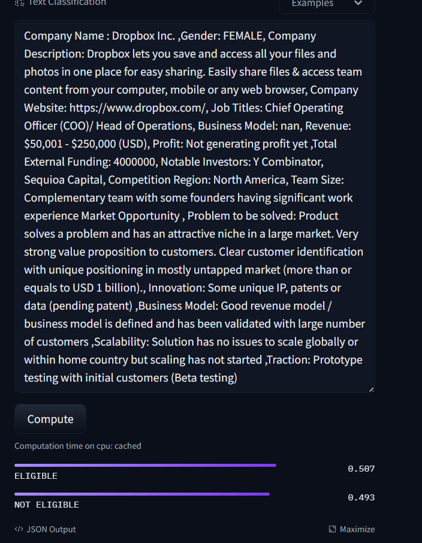

# Startup Screening Application
## Overview
This project automates the screening process for startups by leveraging a fine-tuned AI model. The application evaluates startups based on existing criteria and determines their eligibility for funding. The only input required is a CSV file containing the startup details with specific required columns.

## Demo 
<http://cwb-kamo.centralindia.cloudapp.azure.com/> (don't use https)

### Example Output


## Model
https://huggingface.co/k011/startup-score



## Dataset 
https://huggingface.co/datasets/k011/startup_eligibility_scores


## Features
- **Automated Screening:** Streamlines the evaluation process for startups using fine tuned Albert-V2 Model.
- **Fine-Tuned Model:** Utilizes a custom-trained AI model to assess eligibility for funding, a score based system which goes through sentiment analysis to evaluate the startups.
- **CSV Input:** Accepts a CSV file with necessary startup details for evaluation.
- **Eligibility Output:** Provides a clear decision on whether a startup is eligible for funding.

## Prerequisites
- Python 3.x
- Required Python libraries (install via `requirements.txt`)

## Installation
1. Clone the repository:
   ```bash
   git clone https://github.com/kamalika0363/flask-ml.git
   cd flask-ml
   ```

2. Install the required libraries:
   ```bash
   pip install -r requirements.txt
   ```

## CSV File Requirements
The CSV file should contain the following columns:
- **Startup Name:** Name of the startup
- **Founder:** Name(s) of the founder(s)
- **Industry:** Industry sector of the startup
- **Stage:** Current stage of the startup (e.g., Seed, Series A)
- **Funding Needed:** Amount of funding required
- **Revenue:** Current revenue of the startup
- **Employee Count:** Number of employees

### Example CSV Format
```csv
Company Name: Startup 2
Gender: MALE
Company Description: Airbnb, Inc. is an online marketplace for short- and long-term homestays and experiences. We act as a broker and charges a commission from each booking. 
Company Website: https://www.airbnb.com
Job Titles: Chief Executive Officer (CEO)
Business Model: nan
Revenue: Not generating revenue yet
Profit: Not generating profit yet
Total External Funding: 0
Notable Investors: nan
Competition Region: South East Asia
The team consists of experienced professionals from diverse backgrounds.
```

## Usage
1. Ensure your CSV file is formatted correctly as per the requirements.
2. Run the application:
   ```bash
   python process_csv.py
   ```
3. The application will process the CSV file and output the eligibility results.


### Example Command
```bash
python app.py
```

## Output
The application will generate an output file `company_paragraphs.txt` with the following columns:
- **Startup Name:** Name of the startup
- **Eligibility:** "Eligible" or "Not Eligible" based on the evaluation

## Screenshots

